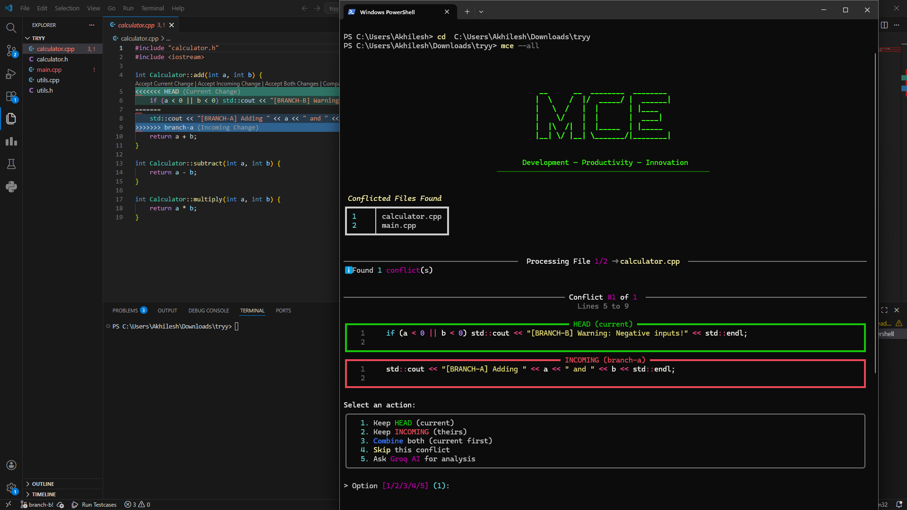

# Merge-Consistency-Engine (MCE)

Here's a glimpse of MCE in action:



A powerful CLI tool designed to simplify and streamline the process of resolving Git merge conflicts.

## Key Features
- **Interactive Resolution:** A user-friendly menu to choose between current, incoming, or combined changes.
- **AI-Powered Analysis:** Integration with the Groq API to provide intelligent suggestions for complex conflicts.
- **Batch Processing:** Automatically detect and resolve all conflicted files across your entire repository.
- **Rich Interface:** Clean and informative console output using the `rich` library.

## Quick Start
Run the tool on a specific file:
```bash
python tool/main.py <file_path>
```

Or resolve all conflicts in the repo:
```bash
python tool/main.py --all
```